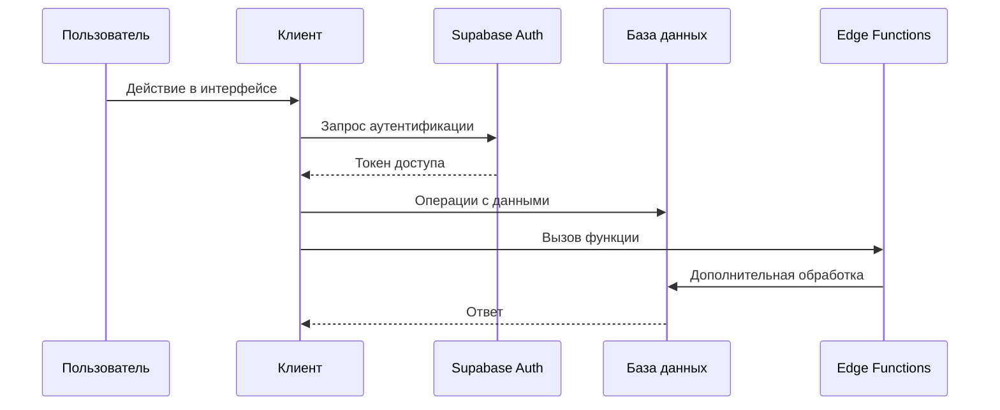

# Архитектура проекта

## Структура каталогов

- `src/components` — готовые React-компоненты пользовательского интерфейса.
- `src/hooks` — кастомные хуки для инкапсуляции повторяемой логики.
- `src/pages` — страницы SPA, объединяющие компоненты в маршруты.
- `src/context` — провайдеры контекста и глобальное состояние приложения.
- `src/utils` — вспомогательные функции и утилиты.
- `src/assets` — статические файлы (изображения, иконки).
- `supabase/functions/import` — Edge Function, принимающая CSV/XLSX и импортирующая данные.
- `supabase/functions/export` — Edge Function, формирующая выгрузку таблиц.
- `supabase/functions/import-export` — комбинированные функции для пакетной обработки данных.
- `supabase/functions/cacheGet` — Edge Function для чтения данных с кэшированием.
- `supabase/migrations` — SQL-скрипты для создания и изменения структуры БД.
- `tests` — модульные тесты Vitest.

## Роли Supabase

- **Аутентификация** — Supabase Auth управляет регистрацией, входом и хранением сессий пользователей.
- **Хранение данных** — PostgreSQL, предоставляемый Supabase, содержит таблицы объектов, оборудования, задач и чата.
- **Edge Functions** — серверные функции на Deno для импорта, экспорта и другой логики, исполняемой вне клиента.

## Взаимодействие клиента с Supabase

## Ограничения функции cacheGet

Edge Function `cacheGet` обслуживает только таблицы из разрешённого списка (на текущий момент `profiles`). Для обращения к функции требуется заголовок `Authorization` с действительным токеном. Запросы к запрещённым таблицам возвращают ответ `403`, отсутствие или неверный токен приводит к ответу `401`.
